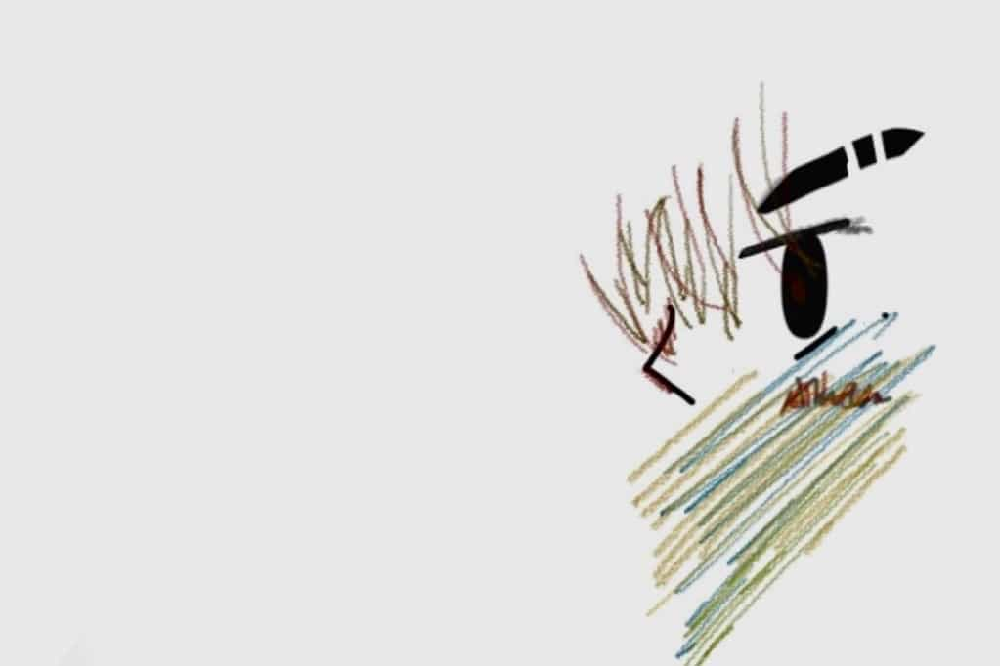

## 🎉HELLO！！！

正在浏览这个小破站的朋友，你好~👋🏼🤓。

我是AlenLiu,一个不知道如何用言语来描述自己的人。但既然是About，所以我还是想介绍一下自己。

***

## AlenLiu的由来：

对我来说，”Alen“意味着<code>前进</code>，而Liu是“廖”在粤语中的读法，受“dim sun”的影响，我也试着将“廖”英语化，事实上，身边的亲戚也进行着这种用法，因此我也采取这种用法，最终取名为”AlenLiu“。
- *其实中间有想过很多的名字，比如“Anlens”“Oiloy”等，但对于我个人而言还是差点意思，终究还是用了Alen*
- *小声说一句：我不太会说粤语，所以这个Liu用我们潮汕话来说是“liao（一三声合并），但这样并不合适，且并未找到有潮汕话音译为英语的情况，所以还是用了Liu”*

***
## 🤠What About Alen?
>https://homepage.alenliu.space/

### <code>🏫GDUFE</code>  23级大一在读

### <code>📸</code> 
我是一个喜欢**摄影**（或许说成拍照更合适，~~怕污名化摄影（bushi）~~）的人，即便色调粗糙，即便构图混乱，但我想，这或许是我所坚持的也是唯一能够说得出口的东西啦😁

> https://gallery.alenliu.space/

### <code>✍️</code> 
或许文采一般，或许逻辑混乱，或许见识短浅，但我还是喜欢书写我的一些日常，或许是诗，或许是随笔，亦或许是一些矫情文章。有了博客之后，我想我会留一个空间给我的<code >洋洋洒洒</code>。

---

<code>🤔</code> 本有一个较为完整的叙述框架，很不幸的是刚刚（24.3.18  ，21：20）离开了我的书桌，因此忘却了本该书写的内容，**日后或许会再次更新About啦**（~~是的，我super容易忘记东西~~）

***
## 🫡有关顶部照片
因为我刚接触博客的世界不久，对于博客以及头像归属权等问题还不太清楚
所以为了避免侵权，我花费了<code>3h</code>制作了我<code>自己的头像</code>。。。（虽然其中的大部分时间是因为我忘记保存了）

***

## 🫂末语
					  不说有力量的话，做有力量的人

初来乍到，望海涵

希望能和博客圈的大家成为各自标准下的有力量的人

😎😁BYEBYE！！希望能够和大家成为朋友~可以互换友链捏